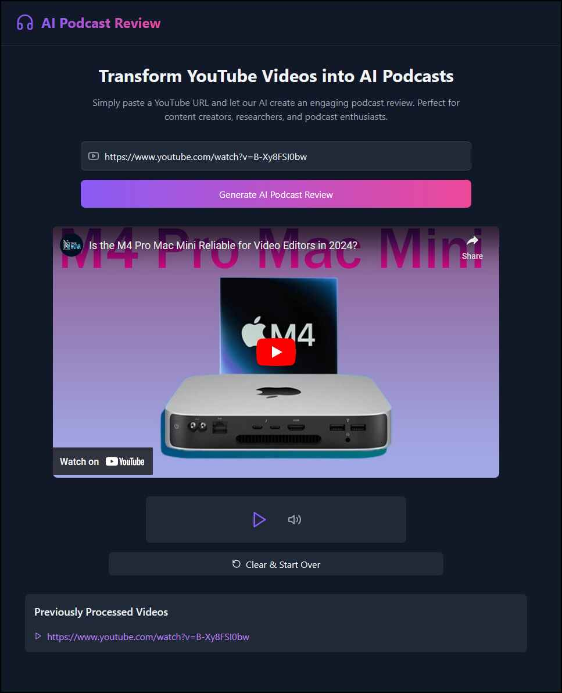

[](https://github.com/bigsk1/podcast-ai/actions/workflows/python-app.yml)
[](https://github.com/bigsk1/podcast-ai/blob/main/LICENSE)


# AI Podcast Generator 🎙️

An AI-powered tool that transforms YouTube videos into engaging podcast discussions. Features a modern web interface for easy use and optional CLI functionality. Downloads videos, transcribes them, and generates natural conversations between AI voices discussing the content.




## Features

- 🎯 Modern web interface for easy podcast generation
- 🎥 Embedded YouTube video player
- 🔊 Interactive audio player for generated podcasts
- 💾 History tracking of processed videos
- 🤖 Natural conversation generation using Claude AI or XAI
- 🗣️ Multiple AI voices using ElevenLabs
- ⚡ Real-time processing status updates
- 📝 Optional fact-checking of content

## Prerequisites


- Node.js 18+ and npm
- Python 3.10+
- GPU (CUDA) or CPU for local transcription, device selection is automatic.
- FFmpeg installed and in PATH
- Nvidia cuDNN installed to path (for nvidia gpu)
- ElevenLabs API key
- Anthropic (Claude) or XAI API key


## Installation

1. Clone the repository:
```bash
git clone https://github.com/bigsk1/podcast-ai.git
cd podcast-ai
```

2. Install frontend dependencies:
```bash
npm install
```

3. Set up Python environment and install dependencies:
```bash
python -m venv venv
source venv/bin/activate  # Linux/Mac
# or
venv\Scripts\activate     # Windows

pip install -r requirements.txt
```

4. Create .env file with your API keys:

```env
# ELEVENLABS VOICE ID'S - add your own voice id's 
VOICE1=111111111111       # male
VOICE2=111111111111       # female

# AI Model Settings - xai, anthropic
AI_PROVIDER=anthropic

# model name: grok-beta, claude-3-5-sonnet-latest
MODEL_NAME=claude-3-5-sonnet-latest

# Podcast Generation Settings
MIN_EXCHANGES=4                    # Minimum number of back-and-forth exchanges
MAX_EXCHANGES=20                   # Maximum number of exchanges
EXCHANGE_LENGTH_MIN_WORDS=20       # Minimum words per exchange
EXCHANGE_LENGTH_MAX_WORDS=150      # Maximum words per exchange

# Audio Length Control
TARGET_LENGTH_MINUTES=3            # Target length for final podcast (in minutes)
LENGTH_FLEXIBILITY=0.2             # Allowed deviation from target (20% = ±36 seconds for 3 min target)
SOURCE_LENGTH_RATIO=0.2            # Target output length as ratio of source (0.2 = 20% of original)
MIN_PODCAST_LENGTH=2               # Minimum podcast length in minutes
MAX_PODCAST_LENGTH=5               # Maximum podcast length in minutes

# Content Coverage
COVERAGE_STYLE=highlights          # comprehensive, summary, or highlights, humor, emotional, debate
FACT_CHECK_ENABLED=false           # Enable AI fact checking
FACT_CHECK_STYLE=balanced          # balanced, critical, or supportive

# Model Settings
TEMPERATURE=0.7
MAX_TOKENS=8192

LOGGING_LEVEL=DEBUG

# Output Directory
OUTPUT_DIR=output

# ANTHROPIC API KEY
ANTHROPIC_API_KEY=your_key_here

# ELEVENLABS API KEY
ELEVENLABS_API_KEY=your_key_here

# For XAI
XAI_BASE_URL=https://api.x.ai
XAI_API_KEY=your_xai_key

# Frontend configuration
VITE_API_URL=http://localhost:5000
```

5. Change voice.json.example to voice.json and add your voice names and id's from elevenlabs, this is a collection that you want to use, set the current voice id in the .env when running the app.


6. Make sure you have ffmpeg installed 

Windows 

```bash
winget install ffmpeg
```

Linux
```bash
sudo apt install ffmpeg
```

## Usage

### Web Interface (Recommended)

1. Start the backend server in one terminal:
```bash
python api.py
```

2. Start the frontend development server in another terminal:
```bash
npm run dev
```

3. Open http://localhost:5173 in your browser

4. Paste a YouTube URL and click "Generate AI Podcast Review"

### CLI Version (Optional)

The tool can also be used from the command line:

```bash
# Basic usage
python main.py "https://www.youtube.com/watch?v=video_id"

# Skip audio generation
python main.py --no-audio "https://www.youtube.com/watch?v=video_id"

# Generate without merging
python main.py --no-merge "https://www.youtube.com/watch?v=video_id"

# Merge audio files manually
python merge_audio_cli.py output conversation.mp3
```

## Output

Generated files are saved in:
- UI version: `public/audio/` directory
- CLI version: `output/` directory

## Configuration Options

All configuration options are set through the .env file. See the sample .env file above for common settings.

## Examples

https://aicodelabs.io/emotional.mp3

<audio controls>
    <source src="https://aicodelabs.io/emotional.mp3" type="audio/mpeg">
    Your browser does not support the audio element.
</audio>

---

https://aicodelabs.io/silo.mp3

<audio controls>
    <source src="https://aicodelabs.io/silo.mp3" type="audio/mpeg">
    Your browser does not support the audio element.
</audio>

---

https://aicodelabs.io/merged.mp3

<audio controls>
    <source src="https://aicodelabs.io/merged.mp3" type="audio/mpeg">
    Your browser does not support the audio element.
</audio>


## License

This project is licensed under the MIT License - see the LICENSE file for details.

## Acknowledgments

- [yt-dlp](https://github.com/yt-dlp/yt-dlp) for video downloading
- [Faster Whisper](https://github.com/guillaumekln/faster-whisper) for transcription
- [ElevenLabs](https://elevenlabs.io/) for text-to-speech
- [Anthropic](https://www.anthropic.com/) for Claude AI

## Contributing

1. Fork the repository
2. Create your feature branch (`git checkout -b feature/amazing-feature`)
3. Commit your changes (`git commit -m 'Add some amazing feature'`)
4. Push to the branch (`git push origin feature/amazing-feature`)
5. Open a Pull Request

## In Progress

1. Getting audio clips longer
2. Audio covers more of the transcript and youtube conversation
3. Adding Openai 
4. Adding ollama
5. Add web search into fact checking of podcast

## Troubleshooting

### Could not locate cudnn_ops64_9.dll

```bash
Could not locate cudnn_ops64_9.dll. Please make sure it is in your library path!
Invalid handle. Cannot load symbol cudnnCreateTensorDescriptor
```

To resolve this:

Install cuDNN: Download cuDNN from the NVIDIA cuDNN page https://developer.nvidia.com/cudnn

Here’s how to add it to the PATH:

Open System Environment Variables:

Press Win + R, type sysdm.cpl, and hit Enter. Go to the Advanced tab, and click on Environment Variables. Edit the System PATH Variable:

In the System variables section, find the Path variable, select it, and click Edit. Click New and add the path to the bin directory where cudnn_ops64_9.dll is located. Based on your setup, you would add:

```bash
C:\Program Files\NVIDIA\CUDNN\v9.5\bin\12.6
```

Apply and Restart:

Click OK to close all dialog boxes, then restart your terminal (or any running applications) to apply the changes. Verify the Change:

Open a new terminal and run

```bash
where cudnn_ops64_9.dll
```

## pyaudio codec issue

Make sure you have ffmpeg inside and adding to PATH on windows terminal ( winget install ffmpeg )
